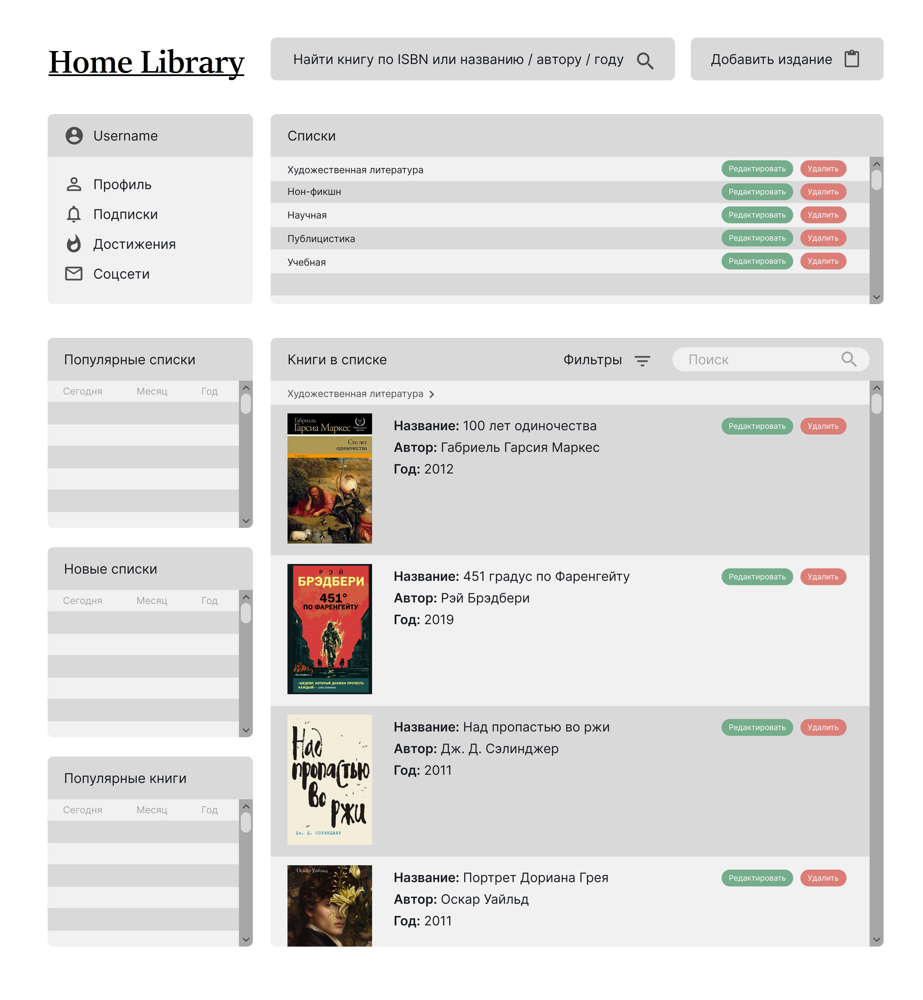

# HomeLibrary

Учебный проект Мельникова Ярослава\
Курс [Kotlin Backend Developer](https://otus.ru/lessons/kotlin/).
Поток курса 2025-02.

HomeLibrary -- сервис для библиофилов и букинистов, позволяющий вести учет домашней библиотеки, 
делиться прочитанными книгами, создавать витрины для продажи и поиска книг и оставлять отзывы после прочтения.
Представляет собой справочник изданий, на основе которого можно создавать собственные списки книг различного назначения.

## Визуальная схема фронтенда

!TODO!

## Документация

1. Маркетинг и аналитика
    1. [Целевая аудитория](./docs/01-biz/01-target-audience.md)
    2. [Заинтересанты](./docs/01-biz/02-stakeholders.md)
    3. [Пользовательские истории](./docs/01-biz/03-bizreq.md)
2. Аналитика:
    1. [Функциональные требования](./docs/02-analysis/01-functional-requiremens.md)
    2. [Нефункциональные требования](./docs/02-analysis/02-nonfunctional-requirements.md)
3. DevOps
    1. [Файлы сборки](./deploy)
4. Архитектура
    1. [ADR](./docs/03-architecture/01-adrs.md)
    2. [Описание API](./docs/03-architecture/02-api.md)
    3. [Компонентная схема](./docs/03-architecture/03-arch.md)
5. Тесты

# Структура проекта

Домашнее задание
Разработка API с использованием OpenAPI

Цель:
научиться использовать OpenAPI;
разработать API для выпускного проекта;
разработать внутренние модели и маперы.

Описание/Пошаговая инструкция выполнения домашнего задания:
создать подпроект в Gradle, в котором будут размещаться модели API с использованием технологии OpenAPI;
создать автоматический тест для проверки корректности сериализации и десериализации моделей;
создать подпроект *-common бэкенда и добавить в него внутренние модели и контекст;
создать мапперы между транспортными и внутренними моделями;
создать автотесты для маперов.

Критерии оценки:
создать подпроект в Gradle, в котором будут размещаться модели API с использованием технологии OpenAPI - 2 балла;
создать автоматический тест для проверки корректности сериализации и десериализации моделей - 2 балла;
создать подпроект *-common бэкенда и добавить в него внутренние модели и контекст - 2 балла;
создать мапперы между транспортными и внутренними моделями - 2 балла;
создать автотесты для маперов - 2 балла.